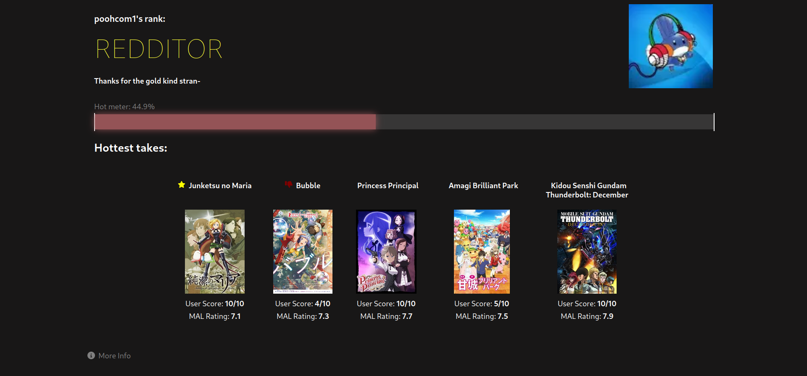
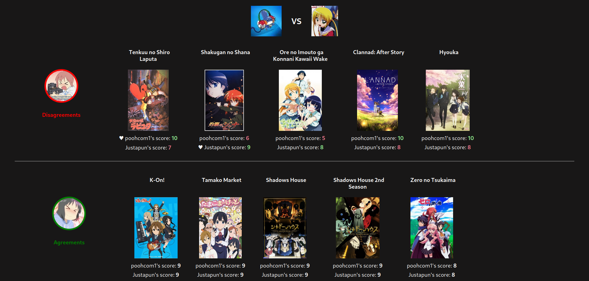

#  Anime Hot Take

A web app to judge how boring your anime tastes are.

Made with the SolidStart.



It can also compare your tastes with someone elses:



## What is a hot take?

A hot take is a _unique_ take. In the most naive form, this is calculated by the difference between a person's anime rating and the anime's average rating. For example, if you like FMA: Brotherhood and give it a 10, that's not a very hot take because everyone also likes that show, so it has an average of 9. So your hot take score for this show would be around 1, which is pretty low. So our core formula for a single anime is is:

$$
score = |r - \mu|
$$

where $r$ is a user's rating and $\mu$ is the mean rating.

However, this tends to favor those with negative scores, as most anime users seem to over rate their shows. For example, Sword Art Online currently has a score of 7.2 on MAL. Due to the show's reputation, it would not be surprisingly for many to give is a score of 1~3. I would not consider this a hot take. On the flip side, giving a hated show a good score _feels_ a lot more like a hot take. As such, the calculation has been adjusted to favor _positive_ scores:

$$

score =
\begin{dcases}
  r > \mu, (r - \mu)^2 \\
  r \leq \mu, | r - \mu |
\end{dcases}


$$

With this formula, positive scores will be squared, so a negative 9 difference is equivalent to a positive 3 difference. This may seem extreme (and it is), but the score is arbitrary anyway and I think hating on popular show is boring so shut up.

But let me know if you have suggestions on the scoring system. All calcalulations are done in the `src/server/calculations.ts` file, so you can take a look there.

## Development

### Prerequisites

- node
- npm
- mongodb

### Setup

1. Install dependencies

```sh
npm install
```

2. Create a `.env` file containing the following fields.

```sh
MONGODB_URL=
```

### Running

```sh
npm run dev
```

### Using memory server

If you don't want to bother with a mongodb instance, you can run with a memory server instead:

```sh
npm run dev:mock
```

However, since a lot of calculations are based on existing user, this may break a lot of functionalities. If you want to populate the memory server, you can generate mock data which will be loaded upon server start.

1. Copy `scripts/mock_users.example.json` and to a new file and rename it `scripts/mock_users.json`.
2. Fill this file with a list of random myanimelist users.
3. Run `npm run db:generate` to generate a mock data file.

Now, once you run `npm run dev:mock`, the database will automatically be populated with scores calculated from the mock data file.
